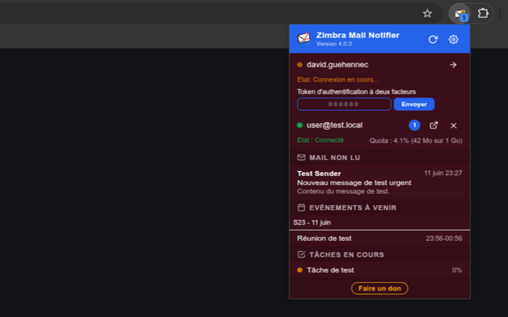
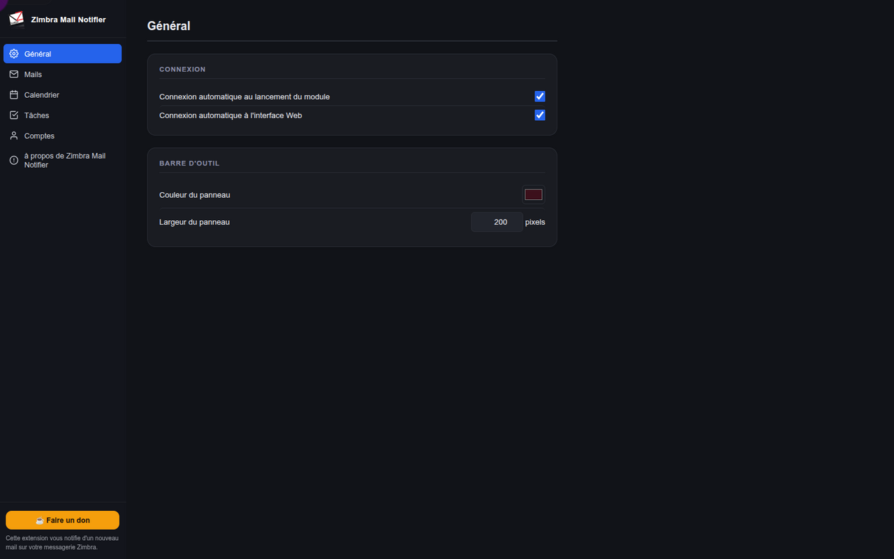
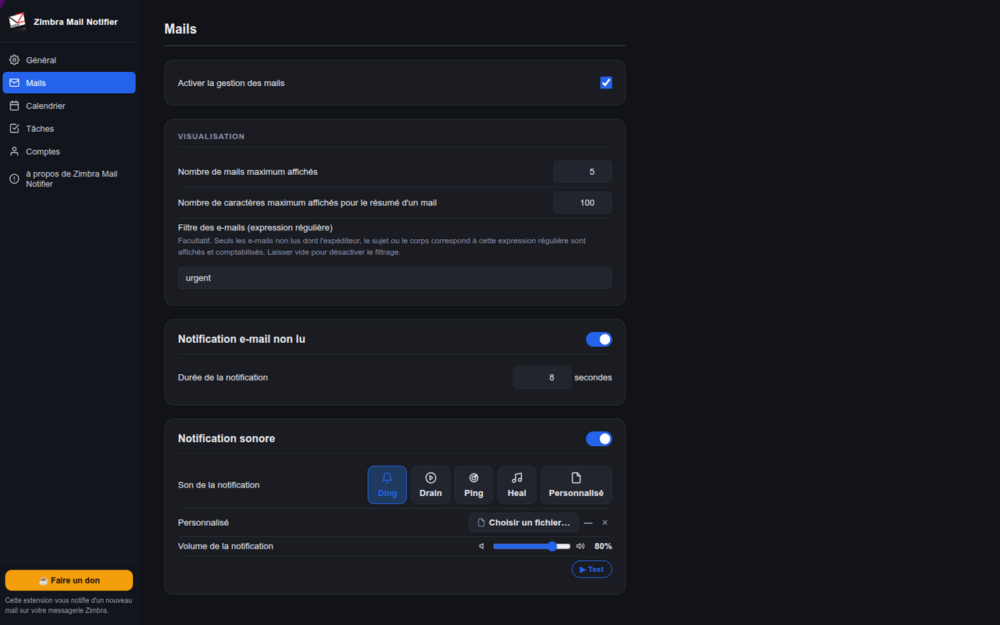
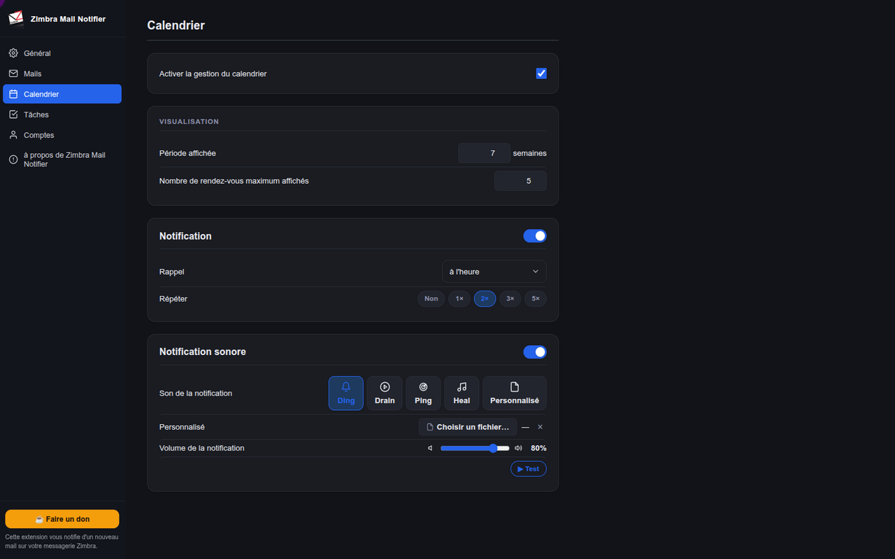
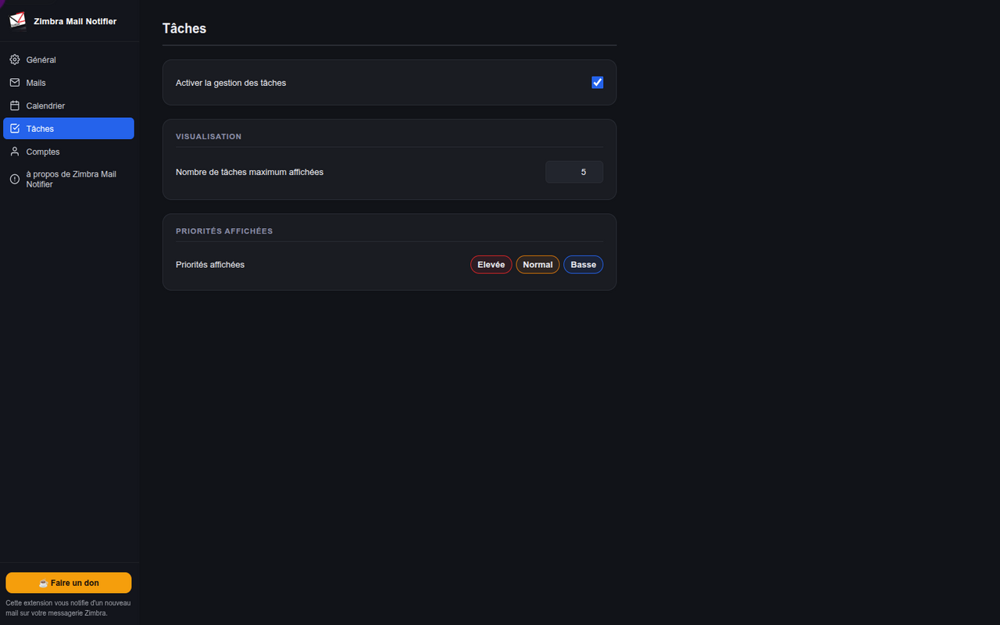
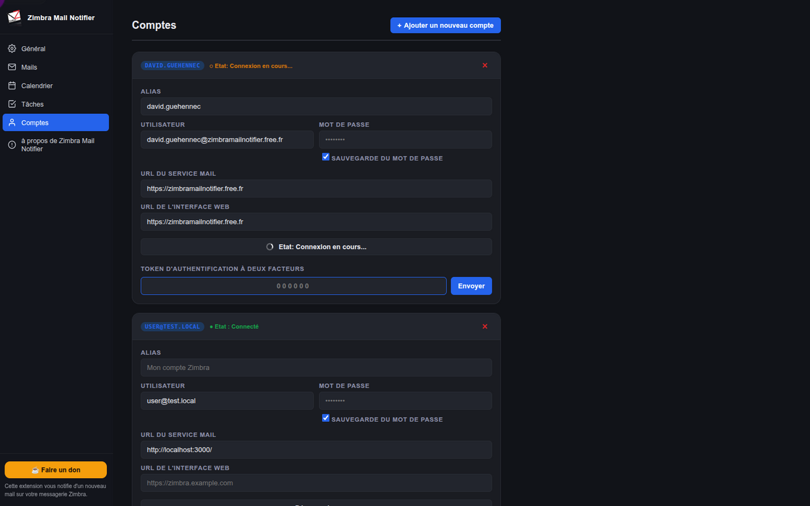

# Zimbra Mail Notifier

Extension navigateur (Chrome MV3) écrite en **TypeScript** pour surveiller un compte Zimbra : messages non lus, calendrier, tâches, notifications bureau et sons.

## Captures d’écran

| Popup | Options — Général |
| ----- | ----------------- |
|  |  |

| Options — E-mail | Options — Calendrier |
| ---------------- | -------------------- |
|  |  |

| Options — Tâches | Options — Comptes |
| ---------------- | ----------------- |
|  |  |

## Fonctionnalités

- Compteur de messages non lus sur l’icône de la barre d’outils
- Notifications bureau à l’arrivée de nouveaux messages
- Affichage des prochains rendez-vous et rappels calendrier configurables
- Suivi des tâches en cours (filtre par priorité)
- Support multi-comptes
- Authentification 2FA et appareil de confiance (trusted device)
- WaitSet (long-poll Zimbra) avec repli sur polling périodique
- Synchronisation optionnelle du cookie `ZM_AUTH_TOKEN` pour ouvrir l’interface web déjà connectée
- Interface traduite (15 langues : en, fr, de, es, it, pt, pt_BR, nl, pl, ru, ja, ko, zh_CN, sr, tr)

## Compatibilité Zimbra

| Supporté | Non supporté (pour l’instant) |
| -------- | ----------------------------- |
| Serveurs Zimbra avec l’interface de connexion standard | Portails avec pré-authentification (ex. `http://zimbra.free.fr`) |

## Prérequis

- Node.js 18+ et npm
- Chrome ou Chromium (extension MV3)

## Installation et build

```bash
npm install

# Build production → dist/, release/
npm run build

# Build développement avec rechargement automatique
npm run watch
```

### Charger l’extension dans Chrome

1. Exécuter `npm run build` (ou `npm run watch:chrome` en dev).
2. Ouvrir `chrome://extensions`.
3. Activer le **mode développeur**.
4. Cliquer sur **Charger l’extension non empaquetée** et sélectionner le dossier `dist/`.

## Scripts npm

| Commande | Description |
| -------- | ----------- |
| `npm run build` | Build production (Webpack) avec fichier zip prêt à être envoyé sur les stores dans le repertoire release |
| `npm run build:chrome` | Build production (Webpack) avec fichier zip prêt à être envoyé sur le store chrome dans le repertoire release |
| `npm run build:chrome:dev` | Build de la version développement pour chrome  |
| `npm run chrome:watch` | Build de la version développement pour chrome avec `--watch` |
| `npm run build:firefox` | Build production (Webpack) avec fichier zip prêt à être envoyé sur le store firefox dans le repertoire release |
| `npm run build:firefox:dev` | Build de la version développement pour firefox  |
| `npm run firefox:watch` | Build de la version développement pour firefox avec `--watch` |
| `npm test` | Tests unitaires (Jest) |
| `npm run test:coverage` | Tests avec rapport de couverture |
| `npm run lint` | ESLint sur `src/` et `tests/` |
| `npm run lint:fix` | ESLint avec corrections automatiques |
| `npm run typecheck` | Vérification TypeScript (`tsc --noEmit`) |

## Structure du projet

```
src/
├── background/worker.ts       # Service worker MV3 (point d’entrée)
├── modules/
│   ├── controller/            # SuperController, Controller, Service
│   ├── service/               # Zimbra SOAP, prefs, crypto, notifications…
│   └── constant/constants.ts
├── types/index.ts             # Types et enums partagés
├── ui/                        # popup, options, offscreen (audio)
├── skin/                      # CSS, icônes PNG, sons OGG
├── _locales/                  # Fichiers i18n
└── manifest.chrome.json       # manifest pour chrome
└── manifest.firefox.json      # manifest pour firefox
tests/                         # Tests Jest (+ mocks Chrome dans setup.ts)
mock-server/                   # Serveur SOAP Zimbra de test (Node.js natif)
dist/                          # Sortie Webpack (à charger dans Chrome)
release/                       # Fichier zip versionné prêt à être envoyé sur le store
```

## Tests

Les tests couvrent la logique métier (Service, ZimbraWebservice, Prefs, Crypto, etc.) avec des mocks des API Chrome.

```bash
npm test
```

## Qualité de code

- **ESLint** : configuration dans `.eslintrc.cjs` (TypeScript + règles type-aware).
- **Prettier** : `.prettierrc` (4 espaces, guillemets simples).
- **Locales** : script de vérification dans `script/checkLocale.sh`.

## Serveur mock (développement)

Un serveur SOAP Zimbra local est disponible dans `mock-server/` pour tester l’extension sans serveur réel.

```bash
cd mock-server
node server.js
```

Configuration dans l’extension :

| Champ | Valeur |
| ----- | ------ |
| URL serveur | `http://localhost:3000` |
| URL interface web | `http://localhost:3000/zimbra` |

Compte de test : `user@test.local` / `password` — voir [mock-server/README.md](mock-server/README.md) pour le 2FA, le dashboard et l’API admin.

## Assets (icônes et sons)

Les fichiers binaires sont sous `src/skin/` et copiés dans `dist/` par Webpack :

| Chemin | Description |
| ------ | ----------- |
| `src/skin/images/zimbra_mail_notifier_*.png` | Icônes extension (16–128 px) |
| `src/skin/images/icon_*.png` | États du badge (default, warning, refresh, disabled) |
| `src/skin/*.ogg` | Sons intégrés (`ding`, `drain`, `heal`, `ping`) |

## Licence

Voir [src/license.txt](src/license.txt).
